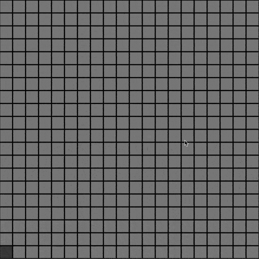
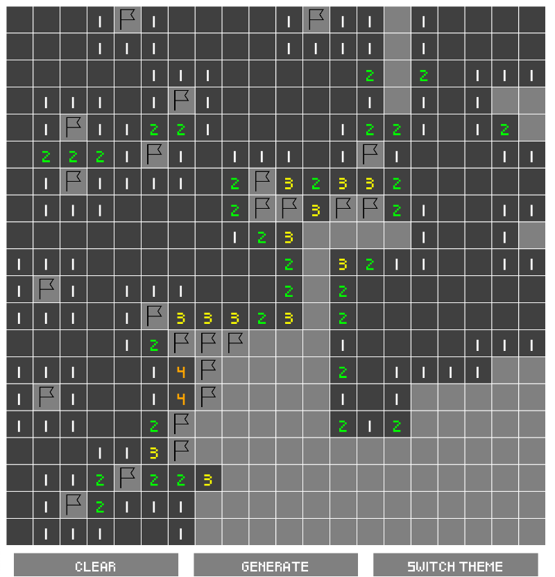
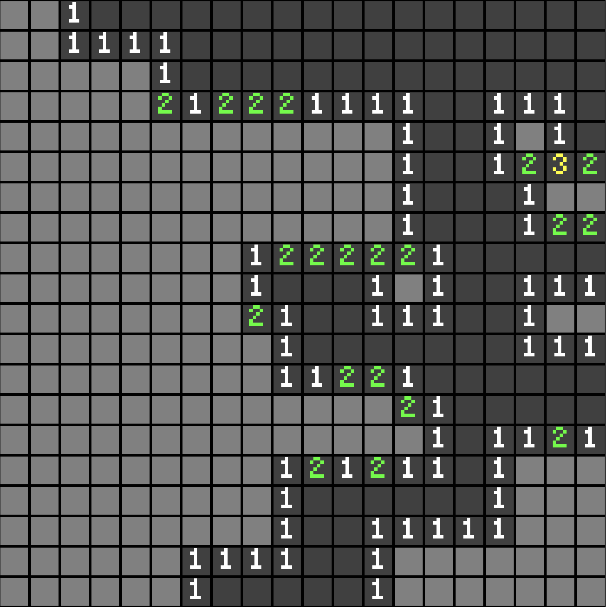

# Minesweeper Tutorial

Source code for the Bevy tutorial by Félix de Maneville.

## Run

use `cargo run` to launch the app in native. Use the `debug` feature for debug inspector and board console output.

### Using CMake

* Native: `cargo make run`
* Browser (wasm): `cargo make serve` 

> a `release` profile is configured

## Play

### Board interaction

Use the *left* mouse button to uncover tiles, and the *right* mouse button to mark tiles.

### Clear and generate

Press `C` to clear the current board, and `G` to generate a new board

### Dark theme

Press `S` to toggle the dark theme

## Board edition

The application loads its theme from files in the `assets` folder (see `main.rs`).
You may edit the files or edit the `main.rs` file